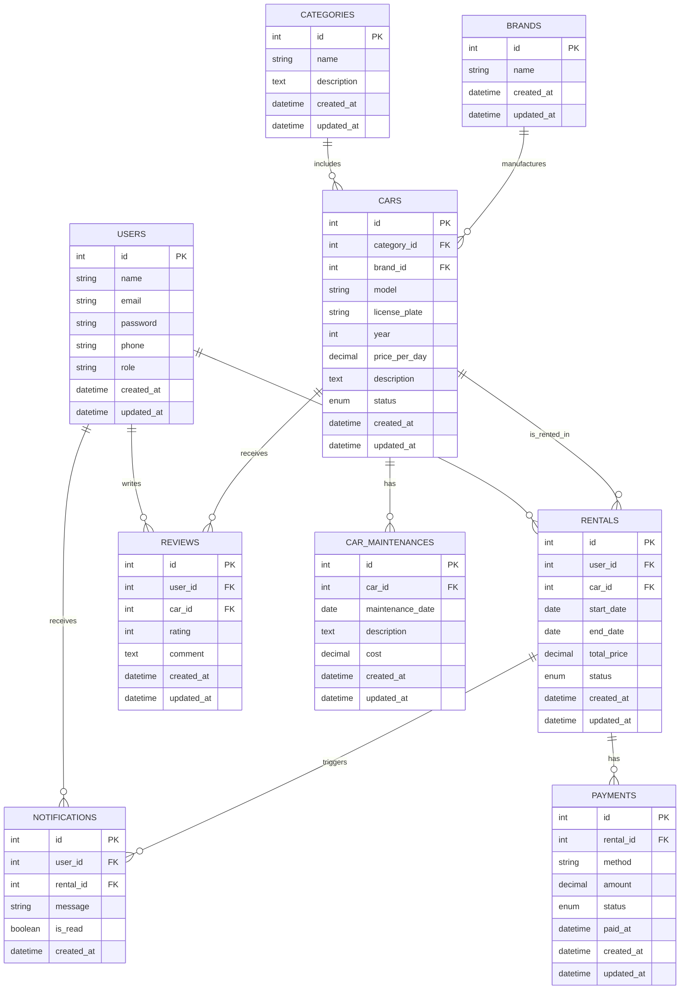

# Sistem Rental Mobil

```mermaid
erDiagram
    USERS ||--o{ RENTALS : makes
    USERS ||--o{ REVIEWS : writes
    USERS ||--o{ NOTIFICATIONS : receives

    CARS ||--o{ RENTALS : is_rented_in
    CARS ||--o{ REVIEWS : receives
    CARS ||--o{ CAR_MAINTENANCES : has

    CATEGORIES ||--o{ CARS : includes
    BRANDS ||--o{ CARS : manufactures

    RENTALS ||--o{ PAYMENTS : has
    RENTALS ||--o{ NOTIFICATIONS : triggers

    USERS {
        int id PK
        string name
        string email
        string password
        string phone
        string role
        datetime created_at
        datetime updated_at
    }

    CATEGORIES {
        int id PK
        string name
        text description
        datetime created_at
        datetime updated_at
    }

    BRANDS {
        int id PK
        string name
        datetime created_at
        datetime updated_at
    }

    CARS {
        int id PK
        int category_id FK
        int brand_id FK
        string model
        string license_plate
        int year
        decimal price_per_day
        text description
        enum status
        datetime created_at
        datetime updated_at
    }

    RENTALS {
        int id PK
        int user_id FK
        int car_id FK
        date start_date
        date end_date
        decimal total_price
        enum status
        datetime created_at
        datetime updated_at
    }

    PAYMENTS {
        int id PK
        int rental_id FK
        string method
        decimal amount
        enum status
        datetime paid_at
        datetime created_at
        datetime updated_at
    }

    REVIEWS {
        int id PK
        int user_id FK
        int car_id FK
        int rating
        text comment
        datetime created_at
        datetime updated_at
    }

    CAR_MAINTENANCES {
        int id PK
        int car_id FK
        date maintenance_date
        text description
        decimal cost
        datetime created_at
        datetime updated_at
    }

    NOTIFICATIONS {
        int id PK
        int user_id FK
        int rental_id FK
        string message
        boolean is_read
        datetime created_at
    }


```
