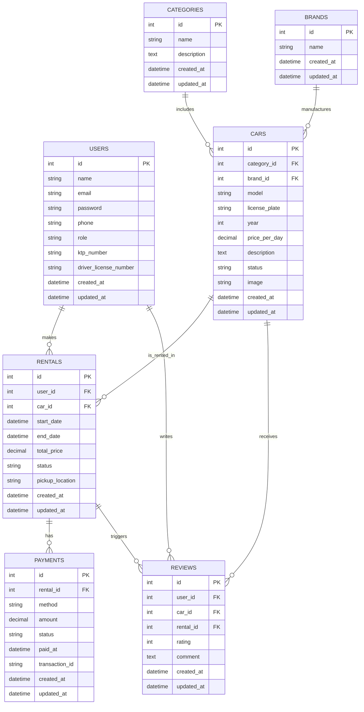

# Sistem Rental Mobil

```mermaid
erDiagram
    USERS ||--o{ RENTALS : makes
    USERS ||--o{ REVIEWS : writes

    CARS ||--o{ RENTALS : is_rented_in
    CARS ||--o{ REVIEWS : receives

    CATEGORIES ||--o{ CARS : includes
    BRANDS ||--o{ CARS : manufactures

    RENTALS ||--o{ PAYMENTS : has
    RENTALS ||--o{ REVIEWS : triggers

    USERS {
        int id PK
        string name
        string email
        string password
        string phone
        string role
        string ktp_number
        string driver_license_number
        datetime created_at
        datetime updated_at
    }

    CATEGORIES {
        int id PK
        string name
        text description
        datetime created_at
        datetime updated_at
    }

    BRANDS {
        int id PK
        string name
        datetime created_at
        datetime updated_at
    }

    CARS {
        int id PK
        int category_id FK
        int brand_id FK
        string model
        string license_plate
        int year
        decimal price_per_day
        text description
        string status
        string image
        datetime created_at
        datetime updated_at
    }

    RENTALS {
        int id PK
        int user_id FK
        int car_id FK
        datetime start_date
        datetime end_date
        decimal total_price
        string status
        string pickup_location
        datetime created_at
        datetime updated_at
    }

    PAYMENTS {
        int id PK
        int rental_id FK
        string method
        decimal amount
        string status
        datetime paid_at
        string transaction_id
        datetime created_at
        datetime updated_at
    }

    REVIEWS {
        int id PK
        int user_id FK
        int car_id FK
        int rental_id FK
        int rating
        text comment
        datetime created_at
        datetime updated_at
    }


```
