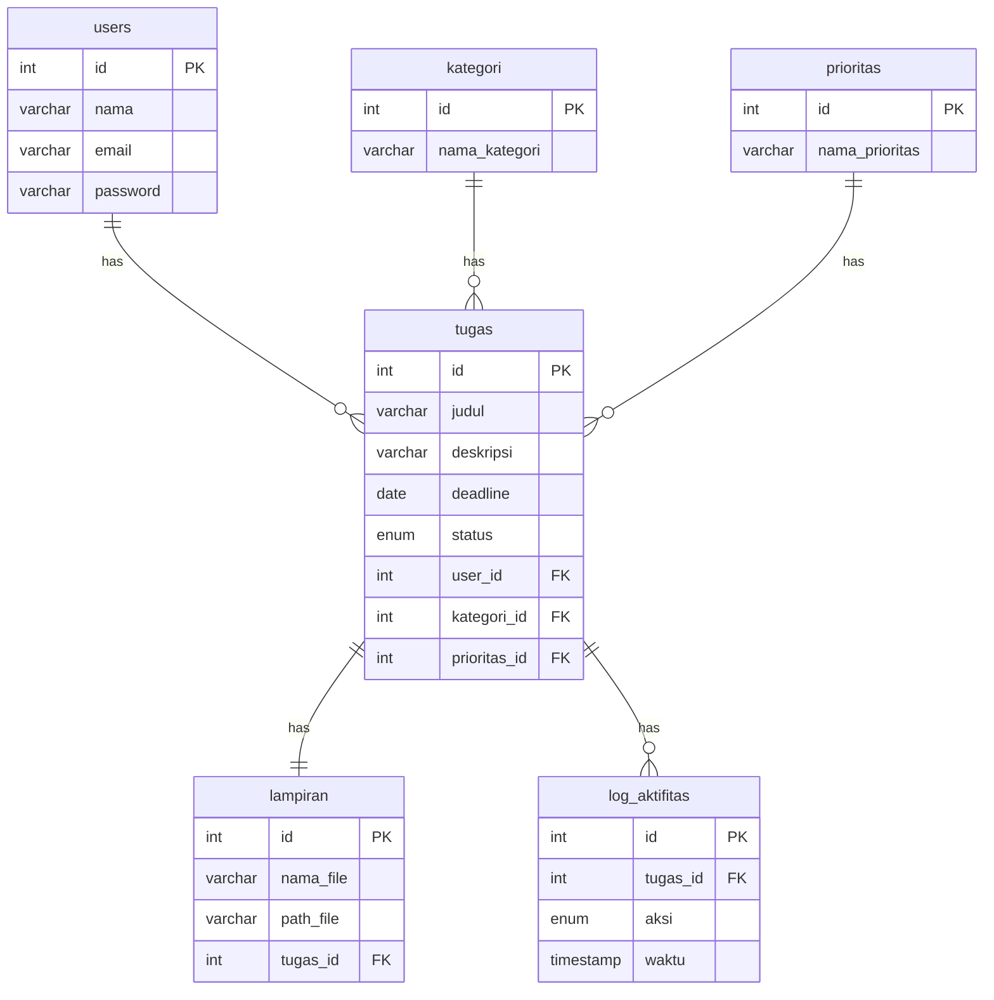

# Manajemen Tugas

```mermaid
erDiagram
    users ||--o{ tugas : has
    kategori ||--o{ tugas : has
    prioritas ||--o{ tugas : has
    tugas ||--|| lampiran : has
    tugas ||--o{ log_aktifitas : has

    users {
        int id PK
        varchar nama
        varchar email
        varchar password
    }

    kategori {
        int id PK
        varchar nama_kategori
    }

    prioritas {
        int id PK
        varchar nama_prioritas
    }

    tugas {
        int id PK
        varchar judul
        varchar deskripsi
        date deadline
        enum status
        int user_id FK
        int kategori_id FK
        int prioritas_id FK
    }

    lampiran {
        int id PK
        varchar nama_file
        varchar path_file
        int tugas_id FK
    }

    log_aktifitas {
        int id PK
        int tugas_id FK
        enum aksi
        timestamp waktu
    }

```
